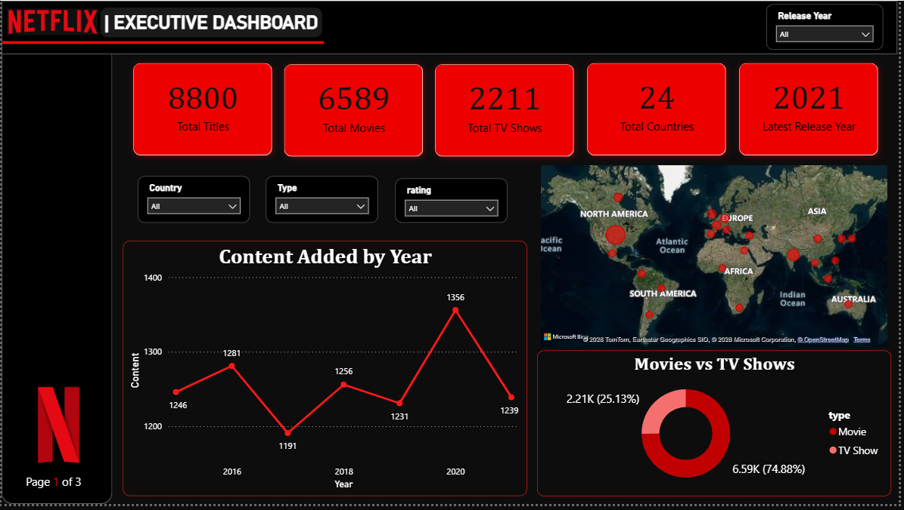
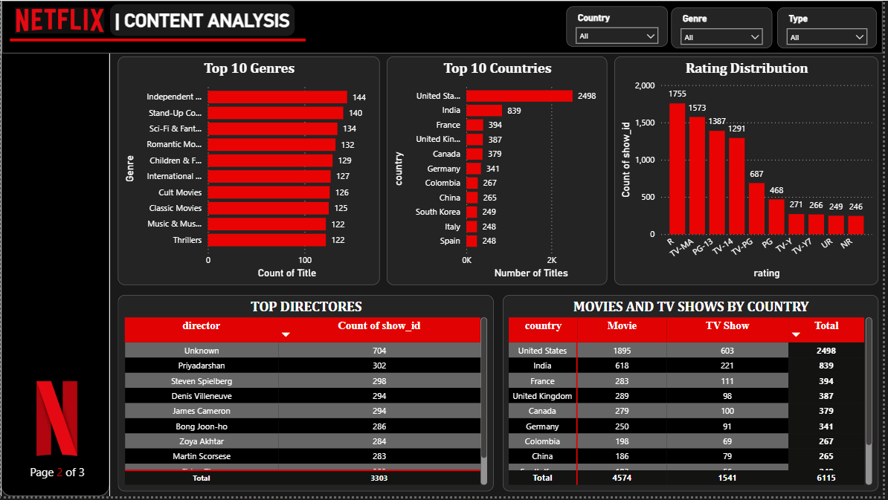

# Netflix Data Analysis Dashboard

## Project Overview
This project analyzes the Netflix Movies and TV Shows dataset using Power BI and Python. The dashboard provides interactive insights about Netflix content, genres, countries, ratings, and release trends.

## Objectives
- Clean the raw Netflix dataset
- Analyze Movies and TV Shows
- Create an interactive Power BI dashboard
- Generate business insights

## Tools & Technologies
- Power BI
- Python
- Pandas
- Excel

## Dataset
- Netflix Movies & TV Shows Dataset
- Cleaned using Python (Pandas)

## Dashboard Features
- Total Titles KPI
- Movies vs TV Shows
- Top 10 Genres
- Top 10 Countries
- Rating Distribution
- Content Added by Year
- Interactive Filters

## Key Insights
- Netflix's content library includes 8800 titles, with 74.88% largest share of Movies.
- Content releases grew exponentially from 2000 to 2020, peaking at 422 titles in a single year.
- The platform offers content across 24 countries, United States contributes the largest share of content with 2498 titles.
- Content with R rating is contribute largest share with 1755 titles.

## Project Files
- Netflix Data Analysis.pbix
- netflix_titles_cleaned.csv
- netflix_data.py
- Dashboard Screenshots

## Dashboard Preview

### Dashboard - Page 1

### Dashboard - Page 2

## Author
Utsav Prajapati
